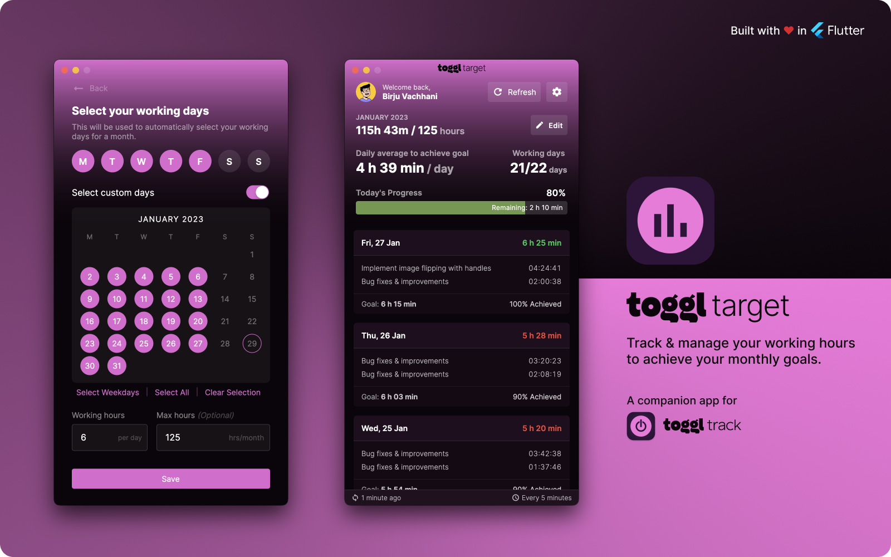

<!--  -->

<br/>


A companion app for [Toggl track][toggl] to track & manage your working hours to achieve your monthly goals. If you're using [Toggl Track][toggl] to track your time then, this app can help you manage your monthly working hours.

# Features

- Custom working days selection to adjust for leaves and holidays.
- Set max monthly hours limit.
- Supports tracking per workspace, per project on [Toggl Track][toggl].
- Auto syncs stats at configurable intervals.
- Beautiful themes to select from.
- Tracks per day average working hours based on already tracked hours.
- Displays today's progress in system tray on desktop.
- Integrates with system tray on desktop for quick controls.

## Supported Platforms

| Android | iOS | macOS | Windows | Linux | Web |
|---------|-----|-------|---------|-------|-----|
| ✅       | ✅   | ✅     | ✅       | ✅     | ❌   |

### Disclaimer

> This is not an independent timer tracking app. It does not have ability to record your time. You have to use [Toggl Track][toggl] to track your time. This is a companion app to help you track your goals for achieving daily/monthly goals. It also allows you to set a max limit for monthly goal.

## Motivation

I love [Toggl Track][toggl] and I use it daily to track my working hours and generate time sheet at the end of the month. It provides almost all the things I need from a time tracking app except one thing. I usually find my self working on projects that are billed hourly. Sometimes, these projects have a max cap for working hours per month. So to make sure I only work in these constraints, I found myself checking reports on [Toggl Track][toggl] website to see for how many hours I have worked. While [Toggl Track][toggl] shows stats on your tracked time, it doesn't have any knowledge of my monthly limits, or my working days. So I had to calculate how many hours I can work each remaining days to ensure that I don't go overboard. 

Ideally, I'd prefer to have **fixed** working hours each day, however it's not always the case in real world. Some day I'd have more work, so I might work an extra hour or two. Some day I wouldn't have much going on, so I might just work for fewer hours. It's very difficult to control this on daily basis. Another situation I found myself is when I have very flexible deadline and I don't want to work too much in a single day to balance my work life, but I would end up working way more than initially planned simply because I **lose track** of my hourly goal/limit per day to do so (since I can always pick up from where I left next day). This is kind of important for my peace of mind and to make sure that I don't stretch myself too much when I clearly have enough time on upcoming days to finish a given work/task.

I was tired of manually keeping track of my daily and monthly goals and limits to make sure don't work too much and I don't go **overboard** for my monthly working hours limits. Hence, the birth of this **companion** app. 

**This app has only one primary goal:** _Help me visualize my daily and monthly target and goals by doing all the calculations automatically, so I don't have to go through the same tedious task every day! And it does its job perfectly!_ 

## How to get API key from Toggl Track

You can navigate to your [profile](https://track.toggl.com/profile) on [Toggl Track][toggl] to get your access token. Make sure you're logged in!


## Build from source

1. Clone the repo
2. Install dependencies with `flutter pub get`
3. Run app with `flutter run` on supported platforms.

## Contribution

You are most welcome to contribute to this project!

Please have a look at [Contributing Guidelines](https://github.com/BirjuVachhani/adaptive_theme/blob/main/CONTRIBUTING.md), before contributing and proposing a change.

## Liked this app?

Show some love and support by starring the repository. ⭐

Want to support my work?

<a href="https://github.com/sponsors/BirjuVachhani" target="_blank"></a>

Or You can

<a href="https://www.buymeacoffee.com/birjuvachhani" target="_blank"></a>

```
MIT License

Copyright © 2023 Birju Vachhani

Permission is hereby granted, free of charge, to any person obtaining a copy
of this software and associated documentation files (the "Software"), to deal
in the Software without restriction, including without limitation the rights
to use, copy, modify, merge, publish, distribute, sublicense, and/or sell
copies of the Software, and to permit persons to whom the Software is
furnished to do so, subject to the following conditions:

The above copyright notice and this permission notice shall be included in all
copies or substantial portions of the Software.

THE SOFTWARE IS PROVIDED "AS IS", WITHOUT WARRANTY OF ANY KIND, EXPRESS OR
IMPLIED, INCLUDING BUT NOT LIMITED TO THE WARRANTIES OF MERCHANTABILITY,
FITNESS FOR A PARTICULAR PURPOSE AND NONINFRINGEMENT. IN NO EVENT SHALL THE
AUTHORS OR COPYRIGHT HOLDERS BE LIABLE FOR ANY CLAIM, DAMAGES OR OTHER
LIABILITY, WHETHER IN AN ACTION OF CONTRACT, TORT OR OTHERWISE, ARISING FROM,
OUT OF OR IN CONNECTION WITH THE SOFTWARE OR THE USE OR OTHER DEALINGS IN THE
SOFTWARE.

```

[toggl]: https://toggl.com/track/
